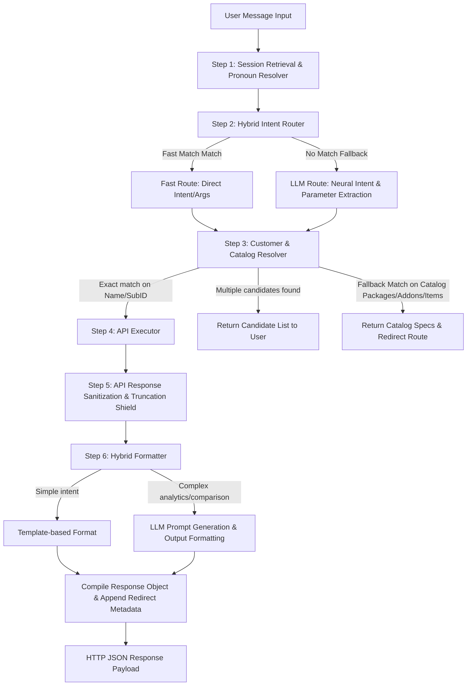

# BillerQ AI Assistant — Comprehensive Architecture, Workings, & Features Manual

This manual provides an in-depth technical breakdown of the BillerQ AI Assistant chatbot. It covers the end-to-end request pipeline, modular software components, dynamic multi-tenant authentication engine, hybrid intelligence router, entity resolver with cascading fallbacks, and a complete catalog of features.

---

## 1. Executive Summary & Design Philosophy

The BillerQ AI Assistant is a context-aware, secure, and multi-tenant conversational interface designed specifically for the BillerQ Cable TV and Subscription Management platform. Rather than acting as a simple Q&A bot, it is engineered as an **agentic system** that links natural language requests directly to the BillerQ Laravel PHP backend REST API.

```
+------------------+     Natural Language     +-------------------------+
|                  | -----------------------> |                         |
|   BillerQ User   |                          |   BillerQ AI Assistant  |
|  (Admin/Agent)   | <----------------------- |    Orchestrator Loop    |
|                  |     Formatted Text &     +-------------------------+
+------------------+     Direct Redirects                  |
                                                           | Mapped API Calls
                                                           v
                                              +-------------------------+
                                              |    Laravel API Tenant   |
                                              |      Database Layer     |
                                              +-------------------------+
```

### Core Architectural Goals
1. **Low Latency & High Speed**: Minimize Large Language Model (LLM) processing overhead by implementing a hybrid regex-routing engine that bypasses neural generation for routine requests.
2. **Context Preservation**: Retain a stateful memory of the conversation context, resolving pronouns (like "his" or "her") dynamically without requiring the user to restate the target entity.
3. **Multi-Tenant Data Isolation**: Dynamically accept and enforce authorization tokens and tenant domains from the logged-in frontend user session to prevent cross-company data leakage.
4. **Resiliency and Self-Healing**: Handle token expiration, non-admin permission variations, and nested API data bloat gracefully through custom client wrappers and payload sanitization layers.
5. **Actionable UI Integration**: Accompany text-based reports with dynamic metadata (like casing-sensitive route strings) that prompt the React frontend to display click-to-navigate action buttons.

---

## 2. End-to-End Request Processing Pipeline

Every user message sent to the chatbot follows a strict six-step execution workflow. This section outlines the operations, transformations, and state transitions of each step.



### Step 1: Session Retrieval & Pronoun Resolver
When the FastAPI server receives an HTTP POST request to `/chat`, it retrieves the user's session identifier (`session_id`). 
* The `MemoryManager` looks up the corresponding `ConversationMemory` instance.
* The message text is passed through the `resolve_pronoun()` state machine. It matches possessive and direct pronouns (e.g., *"his details"*, *"her bills"*, *"their complaints"*, *"this customer"*) and replaces them with the `last_customer_name` stored in the session memory. For example, if Jinto was previously discussed, *"Show his balance"* becomes *"Show Jinto's balance"*.

### Step 2: Intent Classification & Parameter Extraction (Hybrid Intent Router)
The resolved message is analyzed to identify the target tool and arguments.
1. **The Fast Router**: Scans the text for predefined regular expressions corresponding to common queries (such as customer status counts, reports, and payments). If a match is found, the system immediately generates a plan containing the mapped `tool`, `arguments`, and extracted search strings, completely skipping the LLM call.
2. **The LLM Router**: If regex routing fails, the system sends the user message to the local LLM (Qwen) along with the `ROUTER_SYSTEM_PROMPT_TEMPLATE`. This prompt instructs the LLM to output a JSON object containing the classified tool, arguments (like `status: "open"`), and the target customer's identifier string.

### Step 3: Entity Resolution (Resolver & Catalog Fallback Cascade)
Intents involving a specific customer (e.g., profiles, stb logs, subscription plans, invoices, payments) require a unique database ID.
1. **Clean-up**: The resolver strips conversational noise (like `"subscriber id "`, `"customer "`, `"sub id "`) from the extracted entity string.
2. **Dynamic Search API**: The system queries the BillerQ backend search endpoint using `search_customer()`.
3. **Cascading Match**:
   * *Subscriber ID*: Check if the query matches a customer's `subscriber_id`.
   * *Mobile*: Check if it matches a `mobile` or `phone` number.
   * *Name Similarities*: Match names based on exact case-insensitive matches, prefix matches, and substring matches.
4. **Candidates Resolution**: If multiple customers match, the resolver aborts the query and returns a candidate list (e.g., *"Did you mean Jinto (Area A) or Jinto (Area B)?"*) with navigation links.
5. **Catalog Fallback Cascade**: If no customer matches, the resolver shifts to check the service catalog:
   * **Packages**: Scans `get_packages` for name matches. If found, returns package specifications (HSN/SAC, Price, Connection Type, Duration) and redirects to the package list.
   * **Add-ons**: Scans `get_all_addons` for title matches. If found, returns pricing and status.
   * **Items**: Scans `get_items` for item name matches. If found, returns description and pricing.
6. **Context Fallback**: If no customer name is provided but the tool requires one, the resolver looks up the last active `customer_id` and `customer_name` from the session context.

### Step 4: Action Execution (Executor Layer)
The `Executor` takes the resolved intent and parameters, attaches the session token, and triggers the corresponding tool function in `tools/*`. 
* If **Demo Mode** is enabled (`DEMO_MODE=true`), the executor returns mock data structures to facilitate rapid frontend development.
* In **Live Mode**, the executor invokes the `api_client` to perform asynchronous HTTP requests to the BillerQ Laravel API backend.

### Step 5: API Response Sanitization & Truncation Shield (Pagination Shielding)
Raw API responses are often bloated with nested metadata, logs, and relationships.
1. **Data Pruning**: Before passing the data to the LLM for formatting, the system recursively removes bulky attributes (e.g., stripping the complete `user` sub-records and forum comment logs from complaints data).
2. **Dynamic Pagination Check**: BillerQ API returns a maximum of 5 records per page, but reports the true database count in headers or root metadata keys (like `total`). The system captures this value before truncating the local list to the top 5 records. This ensures that the formatter can write: *"There are 86 complaints. Here are the top 5:"* instead of incorrectly reporting only 5 complaints.
3. **Payload Capping**: The total length of the JSON string is restricted to 4,000 characters to prevent LLM context limit errors.

### Step 6: Response Formatting (Hybrid Formatter)
The formatted payload and the user's original query are sent to the `Formatter`.
1. **Template Formatting**: For simple, standardized intents, the system uses fast template functions to bypass the LLM. E.g., formatting customer status counts, connection statistics, and recent transaction structures.
2. **LLM Formatting**: For complex queries, comparative statements, and reports, the system feeds the data into the local LLM using the `FORMATTER_SYSTEM_PROMPT_TEMPLATE`. This prompt instructs the model to highlight key statistics, names, and amounts using Markdown, apply appropriate emojis, use the rupee symbol (`₹`), and limit the list output to 5 items.
3. **Response Assembly**: The formatted text is combined with metadata (e.g. redirect URL, resolved customer IDs) and returned as a JSON response.

---

## 3. Directory Structure & File Map

```
ai-agent/
├── app.py                      # FastAPI Application Entrypoint & CORS Middleware
├── requirements.txt            # Python dependencies (fastapi, httpx, ollama, pydantic, dotenv)
├── .env                        # System Environment Configurations
├── app_data/                   # Metadata, local storage cache
├── api/
│   ├── client.py               # Asynchronous HTTP wrapper, auth retries, & pooling
│   └── registry.py             # Laravel API Endpoint Registry & Endpoint Helper
├── agent/
│   ├── agent_loop.py           # Orchestration controller, tools map, and rule templates
│   ├── planner.py              # User intent classifier & parameter extractor
│   ├── resolver.py             # Entity lookup engine with product/service catalog fallback
│   ├── executor.py             # Intent-to-tool mapper & data cleaner
│   ├── formatter.py            # Conversational formatting engine (LLM & Fallback templates)
│   └── memory.py               # Conversational memory cache & pronoun resolver
├── llm/
│   ├── base.py                 # Abstract base class interface for LLM providers
│   ├── ollama_provider.py      # Async client for local Ollama deployments
│   └── bedrock_provider.py     # AWS Bedrock fallback provider
├── prompts/
│   ├── planner_prompt.txt      # LLM Prompt for Intent Classification
│   └── formatter_prompt.txt    # LLM Prompt for Response Formatting
├── chat-widget/
│   └── chat.html               # Frontend chat iframe with CryptoJS token decryption
└── tools/                      # Modular Business Logic Layer
    ├── customer.py             # Customer profile, search, and STB tools
    ├── payment.py              # Invoicing, transaction history, and overdues tools
    ├── subscription.py         # Subscriptions, addons, and item catalog tools
    ├── reports.py              # Package, tax, agent collections, dashboard reports
    ├── complaints.py           # Complaint list and status statistics tools
    ├── lead.py                 # Enquiries, leads, and followup tools
    ├── banking.py              # Cash accounts and transaction tools
    ├── expenses_income.py      # Vendors, expenses, and headers tools
    ├── staff.py                # System staff and user role retrieval tools
    ├── settings.py             # Provider lists, categories, and credit configs
    └── communication.py        # SMS and WhatsApp logs tools
```

---

## 4. Deep-Dive Codebase Breakdown

### 📂 FastAPI Server Entrypoint: [app.py](file:///c:/Users/advai/Desktop/BILLERQQ/ai-agent/app.py)
`app.py` sets up the FastAPI application, CORS middleware, lifespan events, and global routing endpoints.

*   `_create_llm() -> BaseLLM`:
    *   Reads the `LLM_PROVIDER` environment variable.
    *   Instantiates either the `OllamaProvider` (which connects to the local Ollama instance running Qwen) or the `BedrockProvider` (AWS Bedrock).
*   `lifespan(app: FastAPI)`:
    *   Executes on application startup and shutdown.
    *   Logs startup initialization messages.
    *   Calls `await api_client.close()` on shutdown to release the shared `httpx.AsyncClient` connection pool cleanly.
*   `_build_redirect_metadata(intent: str, plan: dict, result: dict, customer_id: str | None) -> dict`:
    *   Maps classified intents to React Router frontend endpoints.
    *   Returns a dictionary containing `redirect_url` and `redirect_label`.
    *   Supported mappings:
        *   `ACTIVE_CUSTOMERS` $\rightarrow$ `/customers/customer` (View customers)
        *   `REPORT` $\rightarrow$ Checks `report_type` entity. Maps `package` to `/report/package-summary`, `wallet` to `/report/wallet-balance`, and `tax` to `/report/tax-report`.
        *   `UNPAID_CUSTOMERS` $\rightarrow$ `/report/unpaid-customer`
        *   `OVERDUE` $\rightarrow$ `/report/payment-due`
        *   `ANALYTICS` $\rightarrow$ `/dashboard/default`
        *   `INVOICE_DETAIL` or `INVOICE_SUMMARY` $\rightarrow$ `/customers/{customer_id}/invoices/{invoice_id}`
*   `POST /chat` (`chat(request: ChatRequest) -> ChatResponse`):
    *   Accepts `message`, `session_id`, and BillerQ credentials (`billerq_token`, `billerq_api_url`, `billerq_user_role`).
    *   **Safety Filter**: Checks the input for malicious SQL injection patterns and database commands (e.g., `drop table`, `delete database`, `hack`). If detected, it immediately blocks the request and returns a safe notice: *"I cannot perform those actions. Please contact your BillerQ administrator..."*
    *   Loads session memory.
    *   Passes the message through the pronoun resolver.
    *   Authenticates using the provided bearer token.
    *   Executes the orchestrator loop: `await agent.run()`.
    *   If a customer profile query returns a valid customer ID and name, it updates the session context parameters.
    *   Saves the exchange to the session history.
    *   Returns the formatted response text, session ID, and routing metadata.

---

### 📂 Agent Loop Controller: [agent/agent_loop.py](file:///c:/Users/advai/Desktop/BILLERQQ/ai-agent/agent/agent_loop.py)
This is the central coordinator of the chatbot. It contains the import list of all tools, the tool routing map, and rule-based template logic.

*   `TOOL_MAP`:
    *   Maps logical tool names directly to Python callable functions in the `tools/` directory.
    *   Contains 68 mapped endpoints across 11 modules.
*   `BillerQAgent.run(message, context, billerq_token, billerq_api_url, billerq_user_role) -> (str, dict)`:
    *   Determines whether the request is a navigation command (e.g., *"open lead page"*, *"go to billing"*). If so, it returns a redirect response.
    *   Attempts to match the query using the regex-based fast router.
    *   If no match is found, it sends the query to the LLM router (`ROUTER_SYSTEM_PROMPT_TEMPLATE`) to extract the tool, arguments, and customer details.
    *   Enforces parameters (e.g., setting `payment_status="pending"` for queries about unpaid invoices).
    *   Invokes the customer resolver if the tool requires a customer ID.
    *   Runs the target tool: `await self._execute_tool()`.
    *   If the tool returns an error, it responds with a helpful conversational message.
    *   Uses fast formatting templates for common queries to avoid slow LLM calls. E.g., formatting customer status counts, connection statistics, unpaid balances, overdues, and dashboard data.
    *   If a query involves comparing two customers, it resolves both profiles in parallel and formats a markdown table showing the differences.
    *   If the query is complex or comparative, it forwards the data to the LLM formatter.

---

### 📂 Intent & Entity Planner: [agent/planner.py](file:///c:/Users/advai/Desktop/BILLERQQ/ai-agent/agent/planner.py)
The planner classifies the user's intent and extracts parameters from natural language.

*   `VALID_INTENTS`:
    *   Restricts intent classification to a controlled set of 18 categories (e.g. `CUSTOMER_SEARCH`, `CUSTOMER_PROFILE`, `PAYMENT_HISTORY`, `UNPAID_CUSTOMERS`, `COMPARE_CUSTOMERS`, `RECURRING`, `OVERDUE`, `ANALYTICS`, `REPORT`, `COMPLAINTS`).
*   `Planner.plan(message, context) -> dict`:
    *   **Fast Planner Check**: Compares the user prompt against regular expressions to quickly identify intents like `ACTIVE_CUSTOMERS`, `REPORT`, `RECENT_PAYMENTS`, `OVERDUE`, `UNPAID_CUSTOMERS`, `COMPLAINTS`, `SUBSCRIPTION`, and `RECURRING`.
    *   If no regex matches, it loads `planner_prompt.txt` and compiles a prompt containing the conversation history and the user message.
    *   Calls `self.llm.generate_json()` to return a structured intent plan.
    *   Runs the plan through `_validate_plan()` to verify its structure and schema.

---

### 📂 Entity Resolver: [agent/resolver.py](file:///c:/Users/advai/Desktop/BILLERQQ/ai-agent/agent/resolver.py)
The resolver translates natural language entity references into system database IDs.

*   `Resolver.resolve_customer(name: str) -> dict`:
    *   Clears conversational prefixes like `"subscriber no "` and `"customer id "` from the search term.
    *   If in **Demo Mode**, it matches the search term against mock customer records.
    *   In **Live Mode**, it calls the `search_customer()` tool.
    *   Extracts customer records from the response.
    *   If a single customer is found, it returns the record.
    *   If multiple customers match, it tries to identify the best match using a cascading strategy:
        1. Exact Subscriber ID match.
        2. Exact Mobile number match.
        3. Exact Name match.
        4. Prefix match (name starts with query).
        5. Substring match (name contains query).
    *   If the match remains ambiguous, it returns up to 5 candidate profiles.
    *   If no customer is found, it checks the catalog for matches with **Packages**, **Addons**, or **Items**. If a match is found, it returns the catalog specifications and redirects the user to the corresponding catalog view.
*   `Resolver.resolve_customers(names: list[str]) -> list[dict]`:
    *   Uses `asyncio.gather` to resolve multiple customer names in parallel.

---

### 📂 Action Executor: [agent/executor.py](file:///c:/Users/advai/Desktop/BILLERQQ/ai-agent/agent/executor.py)
The executor maps resolved intents to tool functions and handles payload sanitization.

*   `Executor.execute(plan, memory, billerq_token) -> dict`:
    *   Sets the bearer token override on the API client.
    *   If the intent requires a customer ID, it resolves the customer name or retrieves the last referenced customer from the session context.
    *   Invokes `_route()` to call the corresponding tool.
*   `Executor._route(intent, entities, customer_id) -> dict`:
    *   In **Demo Mode**, it returns mock data structures.
    *   In **Live Mode**, it forwards parameters to the mapped tool in `tools/*`.
    *   **Complaints Sanitization**: Since complaints data can be very large, the executor prunes the `complaint_forum` and `user` sub-records, returning only essential fields to prevent token overflow.

---

### 📂 Conversation Memory: [agent/memory.py](file:///c:/Users/advai/Desktop/BILLERQQ/ai-agent/agent/memory.py)
Tracks session history and resolves pronouns.

*   `ConversationMemory`:
    *   Stores `last_customer_id`, `last_customer_name`, `last_intent`, `conversation_history` (limited to 10 turns), and a `last_activity` timestamp.
    *   `is_expired() -> bool`: Returns `True` if the session has been inactive for more than 30 minutes.
    *   `resolve_pronoun(text: str) -> str`: Scans the message for pronouns (e.g. `his`, `her`, `their`, `them`, `this customer`). Replaces them with the `last_customer_name` stored in session memory (e.g., *"Show his billing"* $\rightarrow$ *"Show Jinto's billing"*).
*   `MemoryManager`:
    *   Maintains a dictionary of active sessions.
    *   Automatically cleans up expired sessions on new incoming requests.

---

### 📂 Central API Client: [api/client.py](file:///c:/Users/advai/Desktop/BILLERQQ/ai-agent/api/client.py)
The unified async HTTP connection layer. All tools query BillerQ through this client.

*   `BillerQClient`:
    *   Manages connection pooling using `httpx.AsyncClient`.
    *   `_ensure_token()`: Automatically logs in on startup using the credentials in the `.env` file.
    *   `_login()`: Authenticates using the configured email and password. Updates the base URL to the tenant-specific URL returned in the login payload.
    *   `_request_with_retry(method, endpoint, params, json_data, override_token, override_user_role) -> dict`:
        *   Strips the `/admin` prefix from endpoints if a non-admin role is detected.
        *   Sends requests using the async client.
        *   If a request fails with a `401 Unauthorized` status, it clears the active token, acquires a login lock, logs in again, and retries the request once.
        *   If the request is redirected to an error page or returns HTML, it falls back to the internal admin token.
        *   Includes exponential backoff retry logic (up to 3 attempts) for connection timeouts and rate limits (HTTP 429).

---

## 5. Directory Mapping of Business Logic Tools (`tools/`)

The business logic of the chatbot is organized into modular files within the `tools/` directory.

### 👥 Customer Tools (`tools/customer.py`)
Provides access to customer records.
*   `search_customer(query: str)`: Searches for customers using `/admin/get-customer-search`.
*   `get_customer_profile(customer_id: int)`: Retrieves a customer's profile details using `/admin/get-customer-profile`.
*   `get_all_customers(page: int, **kwargs)`: Retrieves a paginated list of customers using `/admin/show-customer`.
*   `get_customer_status_count()`: Gets customer counts grouped by status using `/admin/get-customer-status-wise-count`.
*   `get_customer_stb(customer_id: int)`: Gets set-top boxes assigned to a customer using `/admin/get-single-customer-stb`.
*   `get_wallets()`: Retrieves wallet lists using `/admin/show-wallet`.

### 💳 Payment & Invoicing Tools (`tools/payment.py`)
Handles invoices, payments, and overdue tracking.
*   `get_payment_history(customer_id: int)`: Gets payment history for a customer using `/admin/get-customer-payment-history`.
*   `get_recent_payments()`: Merges agent cash collection reports and online payment reports, sorts them by date, and returns the most recent transactions.
*   `get_unpaid_customers()`: Retrieves unpaid customer report data using `/admin/get-unpaid-customers`.
*   `get_payment_due_data()`: Gets payment due collection data using `/admin/get-payment-due-data`.
*   `get_overdues()`: Gets overdue summary data using `/admin/overdues`.
*   `get_overdue_list()`: Gets detailed list of overdue payments using `/admin/overdue-list`.
*   `get_invoices(customer_id, **kwargs)`: Gets invoices for a specific customer or across the system using `/admin/show-single-customer-order` or `/admin/show-order`.
*   `get_cancelled_invoices()`: Gets cancelled invoices using `/admin/cancelled-invoice`.

### 📦 Subscription & Catalog Tools (`tools/subscription.py`)
Handles plans, addons, and items catalog details.
*   `get_subscription(customer_id)`: Gets active customer subscriptions using `/admin/show-customer-subscription`.
*   `get_subscription_history(customer_id)`: Gets subscription history using `/admin/customer-subscription-history`.
*   `get_pending_subscriptions()`: Gets pending activations list using `/admin/get-pending-subscription-list`.
*   `get_all_addons()`: Gets all add-ons from `/admin/show-add-on`.
*   `get_items()`: Gets all catalog items using `/admin/show-item`.
*   `get_recurring_data()`: Gets recurring billing profiles using `/admin/get-recurring-data`.

### 📊 Reports Tools (`tools/reports.py`)
Accesses analytics, dashboards, and reporting summaries.
*   `get_dashboard_data()`: Gets main dashboard metrics using `/admin/get-data`.
*   `get_connection_data()`: Gets connection metrics using `/admin/get-connection-data`.
*   `get_package_report()`: Gets package distribution report using `/admin/get-package-report`.
*   `get_wallet_report()`: Gets wallet balance report using `/admin/get-wallet-report`.
*   `get_tax_report()`: Gets tax collection report using `/admin/get-tax-report`.
*   `get_addon_report()`: Gets add-on subscription report using `/admin/get-add-on-report`.
*   `get_agent_collection_report()`: Gets agent collection report using `/admin/get-agent-collection-report`.
*   `get_income_summary(month, year)`: Gets income summary report using `/admin/get-income-summary-report`.
*   `get_expense_summary()`: Gets expense summary report using `/admin/get-expense-summary-report`.

### 🛠️ Complaint Management Tools (`tools/complaints.py`)
Tracks system issues and technical service tickets.
*   `get_complaints()`: Gets complaints using `/admin/get-complaint`.
*   `get_complaint_status_count()`: Gets complaint counts grouped by status using `/admin/complaint-status-count`.
*   `get_problem_types()`: Gets problem categories using `/admin/get-problem-types`.

### 📈 Lead & Enquiry Tools (`tools/lead.py`)
Tracks pipeline opportunities.
*   `get_enquiries()`: Gets enquiries list using `/admin/show-enquiry`.
*   `get_enquiry_status_count()`: Gets enquiry status counts using `/admin/enquiry-status-count`.
*   `get_leads()`: Gets leads list using `/admin/show-lead`.
*   `get_lead_count()`: Gets lead count using `/admin/lead-count`.
*   `get_followups()`: Gets follow-up schedules using `/admin/show-followup`.

### 🏛️ Financial Management Tools (`tools/banking.py` & `tools/expenses_income.py`)
Tracks account records, bank transactions, expenses, and incomes.
*   `get_accounts()`: Gets bank accounts using `/admin/show-account`.
*   `get_transactions()`: Gets bank transactions using `/admin/get-transaction-list`.
*   `get_expenses()`: Gets expenses using `/admin/get-expense`.
*   `get_incomes()`: Gets incomes list using `/admin/get-income`.
*   `get_headers()`: Gets financial header keys using `/admin/get-header`.
*   `get_vendors()`: Gets vendor contacts using `/admin/get-vendor`.

### ⚙️ System settings and logs (`tools/staff.py`, `tools/settings.py`, `tools/communication.py`)
*   `get_staff()`: Gets staff users list using `/admin/view-agent`.
*   `get_roles()`: Gets system roles using `/admin/view-role`.
*   `get_providers()`: Gets CAS/ISP providers using `/admin/display-provider`.
*   `get_message_settings()`: Gets SMS/Whatsapp credit settings using `/admin/get-message-settings`.
*   `get_sms_logs()`: Gets sent SMS logs using `/admin/get-message-sent-log`.
*   `get_whatsapp_logs()`: Gets sent WhatsApp logs using `/admin/get-whatsapp-sent-log`.

---

## 6. Detailed Authentication Flow & Multi-Tenant Isolation

To prevent cross-tenant data access, the system uses a dual authentication strategy.

```
       [ Parent React Portal ]                                  [ Widget Iframe / chat.html ]
                  |                                                           |
1. Encrypts User Token to localStorage                                        |
   Key: "6Lf2jgMqAAAAACyRDVxBwemO3J5uxCMKyvzIvNbV"                             |
                  |                                                           |
                  +--- Mounts Assistant Iframe ------------------------------>|
                                                                              | 2. Reads localStorage.getItem("login")
                                                                              | 3. Decrypts Token using CryptoJS AES
                                                                              |
                                                                              | 4. POST /chat { billerq_token: userToken }
                                                                              |    (Included in JSON payload body)
                                                                              v
                                                                   [ FastAPI Backend app.py ]
                                                                              |
                                                                              | 5. Intercepts JSON Token
                                                                              | 6. Sets override token on Client
                                                                              |
                                                                              | 7. HTTP Request (Authorization Header)
                                                                              v
                                                                     [ Laravel PHP API ]
```

### 1. Dynamic Login & Target Tenant Redirect
The platform is deployed across multiple isolated tenant subdomains (e.g., `https://alpha.billerq.com/api`).
* On startup, if `BILLERQ_AUTO_LOGIN` is enabled, the backend client posts credentials to the global login endpoint `https://admin.billerq.com/public/api/login`.
* The API response contains a tenant-specific URL under the `data.url` key (e.g., `https://tenant-name.billerq.com/public/api`).
* The client dynamically updates `self.base_url` to this URL and routes all subsequent requests to it.

### 2. Frontend Decrypted Token Injection Pipeline
To avoid requiring user credentials in the widget interface, the system securely extracts the active session token from the host portal:
1. When a user logs in to the BillerQ React web application, the portal encrypts their credentials and saves them to `localStorage` under the key `"login"`. The encryption uses AES with the key `6Lf2jgMqAAAAACyRDVxBwemO3J5uxCMKyvzIvNbV`.
2. The widget HTML file (`chat.html`) runs inside an iframe. It reads this local storage key and decrypts it using CryptoJS:
   ```javascript
   const loginStr = localStorage.getItem("login");
   if (loginStr) {
       const decrypted = CryptoJS.AES.decrypt(loginStr, '6Lf2jgMqAAAAACyRDVxBwemO3J5uxCMKyvzIvNbV').toString(CryptoJS.enc.Utf8);
       const loginData = JSON.parse(decrypted);
       const userToken = loginData.userToken;
       const apiHost = loginData.url || "";
       const userRole = loginData.roleId;
       // Sent in request body to FastAPI /chat
   }
   ```
3. The extracted token and tenant URL are sent in the body of the `POST /chat` request.
4. The FastAPI server captures these values and configures the `api_client` base URL and token overrides:
   ```python
   api_client._request_token_override = billerq_token
   api_client.base_url = billerq_api_url
   api_client._request_user_role_override = billerq_user_role
   ```
5. The `api_client` attaches the token to the request headers: `Authorization: Bearer <userToken>`.

### 3. Self-Healing 401 Expiry Loop & Non-Admin Path Correction
* **401 Unauthorized**: If a request returns a `401 Unauthorized` status (e.g., if the user session has expired), the client invalidates the token, acquires an asynchronous lock, calls the auto-login endpoint to get a fresh token, and retries the request once.
* **Non-Admin Path Correction**: BillerQ API endpoints for administrators are prefixed with `/admin` (e.g., `/admin/get-customer-profile`). Non-administrator roles (role ID $\neq 1$) do not have permission to access these paths. If a non-admin role is detected, the client automatically strips the `/admin` prefix from the path (e.g., routing to `/get-customer-profile` instead) to prevent access errors.

---

## 7. Unique Engineering Features

This section highlights the key engineering designs that distinguish this system from standard chatbot templates.

### A. High-Performance Hybrid Router
To reduce response latency, the system uses a regex-based router that processes common queries without querying the LLM.

```
                  +--------------------------------+
                  |       Incoming Query           |
                  +--------------------------------+
                                  |
                                  v
                  +--------------------------------+
                  |  Does query match Fast Router  |
                  |     regular expressions?       |
                  +--------------------------------+
                       /                      \
                     Yes                      No
                     /                          \
                    v                            v
      +----------------------------+     +----------------------------+
      | Bypasses LLM planning.     |     | Forwards query to LLM to   |
      | Immediately executes tool  |     | classify intent and extract|
      | and returns response.      |     | parameters.                |
      | Latency: < 50ms            |     | Latency: 1.5s - 3s         |
      +----------------------------+     +----------------------------+
```

### B. Catalog Fallback Cascade
If a user searches for an entity that is not in the customer database, the resolver searches the product and service catalogs.
* It queries the Packages, Add-ons, and Items endpoints in sequence.
* If a match is found, it returns the technical specifications (pricing, duration, HSN code) and provides a navigation button to direct the user to the correct view in the frontend.

### C. Contextual Pronoun Resolver
The pronoun resolver uses a regex state machine to resolve pronouns based on the previous conversation history.

```python
def resolve_pronoun(self, text: str) -> str:
    if not self.last_customer_name:
        return text

    pronoun_patterns = [
        r"\bhis\b",
        r"\bher\b",
        r"\btheir\b",
        r"\bthem\b",
        r"\bthis customer'?s?\b",
        r"\bthat customer'?s?\b",
        r"\bsame customer'?s?\b",
        r"\bthe customer'?s?\b",
    ]

    modified = text
    for pattern in pronoun_patterns:
        if re.search(pattern, modified, re.IGNORECASE):
            modified = re.sub(pattern, f"{self.last_customer_name}'s", modified, flags=re.IGNORECASE)
            return modified
    return text
```

### D. Pagination Shielding
To prevent large list payloads from causing context limit errors in the LLM, the system truncates API responses while preserving the true record counts.
* The system reads the true database count (e.g., `total: 155`) from the response headers or root keys before truncating the list to the top 5 records.
* This allows the formatter to accurately present the total counts to the user:
  ```
  Total active customers: 1,771
  Here are the top 5:
  • Joy P (Sub ID: 44350)
  ...
  For the remaining, click the link below.
  ```

---

## 8. Detailed Business Feature Checklist

This section lists the supported user queries and how they map to BillerQ API endpoints.

| Feature Area | User Prompt Example | Target Intent | Invoked Backend API | Unique Actions / Metadata |
| :--- | :--- | :--- | :--- | :--- |
| **Customer Search** | *"Find customer Joy P"* | `CUSTOMER_SEARCH` | `/admin/get-customer-search` | Resolves names, mobiles, or IDs; returns profile. |
| **Customer Profile** | *"Show details of subscriber 44350"* | `CUSTOMER_PROFILE` | `/admin/get-customer-profile` | Returns status, contact details, balance, and wallet. |
| **Status Counts** | *"How many active customers do we have?"* | `ACTIVE_CUSTOMERS` | `/admin/get-customer-status-wise-count` | Returns active/inactive percentages; displays metrics summary block. |
| **Archived List** | *"Show deleted customers"* | `CUSTOMER_SEARCH` | `/admin/get-archived-customer` | Lists archived customer entries. |
| **Set-Top Box Info** | *"What is the STB number of Joy P?"* | `STB_INFO` | `/admin/get-single-customer-stb` | Retrieves assigned STB serial numbers and status. |
| **Payments History** | *"Show payments of John Doe"* | `PAYMENT_HISTORY` | `/admin/get-customer-payment-history` | Lists historical customer receipts. |
| **Recent Payments** | *"Show recent payments"* | `RECENT_PAYMENTS` | Merged reports | Merges cash and online collections; sorts by date. |
| **Unpaid Dues** | *"Who has outstanding balance?"* | `UNPAID_CUSTOMERS` | `/admin/get-unpaid-customers` | Summarizes outstanding dues; lists top unpaid accounts. |
| **Highest Dues** | *"Which customer has the highest balance?"* | `UNPAID_CUSTOMERS` | `/admin/get-unpaid-customers` | Sorts accounts by balance; returns the top record. |
| **Overdue Collections** | *"List overdue payments"* | `OVERDUE` | `/admin/overdue-list` | Lists accounts requiring immediate collection. |
| **Online Payments** | *"Show online transactions"* | `RECENT_PAYMENTS` | `/admin/get-online-payment-data` | Filters payment history for online transactions. |
| **Cancelled Orders** | *"Show cancelled invoices"* | `RECENT_PAYMENTS` | `/admin/cancelled-invoice` | Lists cancelled orders and invoices. |
| **Subscriptions** | *"Show active plans of Joy P"* | `SUBSCRIPTION` | `/admin/show-customer-subscription` | Returns plan names, start/end dates, and billing intervals. |
| **Pending Activations**| *"Show pending subscriptions"* | `EXPIRING_SUBSCRIPTIONS` | `/admin/get-pending-subscription-list` | Lists subscriptions awaiting activation. |
| **Recurring Accounts** | *"List recurring profiles"* | `RECURRING` | `/admin/get-recurring-data` | Lists recurring invoice profiles. |
| **Customer Compare** | *"Compare John Doe and Jane Smith"*| `COMPARE_CUSTOMERS` | Multiple profiles | Resolves both profiles in parallel; returns a comparison table. |
| **Package Reports** | *"Show package summary report"* | `REPORT` | `/admin/get-package-report` | Returns subscriber counts grouped by package. |
| **Wallet Reports** | *"Show wallet report"* | `REPORT` | `/admin/get-wallet-report` | Summarizes wallet balances. |
| **Tax Reports** | *"Show tax collection"* | `REPORT` | `/admin/get-tax-report` | Summarizes collected tax amounts. |
| **Agent Collection** | *"How much did Sanjay collect this month?"*| `REPORT` | `/admin/get-connection-data` | Returns collections for a specific agent. |
| **Monthly Collection** | *"Show collection this month"* | `ANALYTICS` | `/admin/get-connection-data` | Returns total collected amount and progress percentage. |
| **Income Summary** | *"Show income summary of May"* | `REPORT` | `/admin/get-income-summary-report` | Returns income report for a specific month. |
| **Expense Summary** | *"Show expense summary"* | `REPORT` | `/admin/get-expense-summary-report` | Returns expense report details. |
| **Complaints List** | *"Show open technical complaints"* | `COMPLAINTS` | `/admin/get-complaint` | Filters complaints by status, category, or area. |
| **Complaint Status** | *"Show complaint status counts"* | `COMPLAINTS` | `/admin/complaint-status-count` | Returns complaint metrics grouped by status. |
| **Problem Categories** | *"List problem types"* | `COMPLAINTS` | `/admin/get-problem-types` | Lists available complaint categories. |
| **Enquiries** | *"Show enquiries"* | `UNKNOWN` (Fast Routed)| `/admin/show-enquiry` | Lists customer enquiries. |
| **Leads** | *"How many leads do we have?"* | `UNKNOWN` (Fast Routed)| `/admin/lead-count` | Returns total lead count. |
| **Follow-ups** | *"Show followups"* | `UNKNOWN` (Fast Routed)| `/admin/show-followup` | Lists scheduled follow-up actions. |
| **Bank Accounts** | *"Show cash accounts"* | `UNKNOWN` (Fast Routed)| `/admin/show-account` | Lists bank and cash accounts. |
| **Bank Transactions** | *"Show bank transactions"* | `UNKNOWN` (Fast Routed)| `/admin/get-transaction-list` | Lists banking transactions. |
| **Expenses** | *"List expenses"* | `UNKNOWN` (Fast Routed)| `/admin/get-expense` | Lists recorded expenses. |
| **Incomes** | *"List income entries"* | `UNKNOWN` (Fast Routed)| `/admin/get-income` | Lists recorded incomes. |
| **Vendors** | *"Show vendors list"* | `UNKNOWN` (Fast Routed)| `/admin/get-vendor` | Lists business vendors. |
| **Financial Headers** | *"Show headers"* | `UNKNOWN` (Fast Routed)| `/admin/get-header` | Lists financial header categories. |
| **Staff Members** | *"List staff"* | `UNKNOWN` (Fast Routed)| `/admin/view-agent` | Lists staff users and agents. |
| **System Roles** | *"List system roles"* | `UNKNOWN` (Fast Routed)| `/admin/view-role` | Lists defined user roles. |
| **SMS Logs** | *"Show SMS logs"* | `UNKNOWN` (Fast Routed)| `/admin/get-message-sent-log` | Lists sent SMS communications. |
| **WhatsApp Logs** | *"Show WhatsApp logs"* | `UNKNOWN` (Fast Routed)| `/admin/get-whatsapp-sent-log` | Lists sent WhatsApp communications. |
| **ISP/CAS Providers** | *"Show providers"* | `UNKNOWN` (Fast Routed)| `/admin/get-provider-for-select` | Lists configured CAS and ISP providers. |
| **Credit Status** | *"Show message settings"* | `UNKNOWN` (Fast Routed)| `/admin/get-message-settings` | Returns SMS and WhatsApp credit status. |
| **Categories Settings**| *"Show settings categories"* | `UNKNOWN` (Fast Routed)| `/admin/get-category-data` | Lists category settings. |
| **Tax Settings** | *"Show tax classes"* | `UNKNOWN` (Fast Routed)| `/admin/get-tax` | Lists tax classes and rates. |
| **Area Select List** | *"Show areas list"* | `UNKNOWN` (Fast Routed)| `/admin/view-area` | Lists billing areas. |
| **Packages List** | *"Show available packages"* | `UNKNOWN` (Fast Routed)| `/admin/view-package` | Lists package catalog. |
| **STB Select List** | *"Show STBs"* | `UNKNOWN` (Fast Routed)| `/admin/view-stb` | Lists all Set-Top Boxes. |

---

## 9. Code Walkthrough: Trace of a Customer Profile Query

This section traces how a user query like *"Show the profile of Jinto"* is processed.

### 1. Reception
* The FastAPI backend receives the request payload:
  ```json
  {
    "message": "Show the profile of Jinto",
    "session_id": "session_992",
    "billerq_token": "4722|Tk4...",
    "billerq_api_url": "https://company-a.billerq.com/api",
    "billerq_user_role": 1
  }
  ```
* FastAPI routes the request to the `chat()` function in `app.py`.

### 2. Pronoun Resolution
* The system checks the session history. Since Jinto is explicitly named, no pronoun resolution is required.

### 3. Intent Routing
* The message is passed to `Planner.plan()`.
* The fast router does not match the query, so it is forwarded to the LLM router.
* The LLM router processes the query and returns a structured plan:
  ```json
  {
    "tool": "get_customer_profile",
    "arguments": {},
    "customer_name": "Jinto"
  }
  ```

### 4. Entity Resolution
* The resolver extracts the search string `"Jinto"` and calls `search_customer("Jinto")`.
* The API returns customer records matching "Jinto".
* The resolver identifies a single exact match:
  ```json
  {
    "id": 8849,
    "name": "Jinto Mathew",
    "mobile": "9876543210"
  }
  ```
* The resolver returns the resolved entity:
  ```json
  {
    "found": true,
    "customer_id": 8849,
    "customer_name": "Jinto Mathew"
  }
  ```

### 5. Execution
* The orchestrator updates the query arguments: `customer_id = 8849`.
* The executor invokes the customer profile tool: `await get_customer_profile(8849)`.
* The API client attaches the bearer token and queries the tenant endpoint: `GET https://company-a.billerq.com/api/admin/get-customer-profile?customer_id=8849`.
* The API returns the customer profile data:
  ```json
  {
    "status": true,
    "data": {
      "customer_name": "Jinto Mathew",
      "customer_details": {
        "subscriber_id": "SUB-9912",
        "mobile": "9876543210",
        "connections": ["STB-1122"]
      },
      "area": "Kochi",
      "join_date": "2024-03-12",
      "paid_amount": "12400.00",
      "open_invoice_amount": "350.00",
      "overdue_invoice_amount": "0.00",
      "wallet_money": "150.00"
    }
  }
  ```

### 6. Formatting
* The response data and intent are passed to the `Formatter`.
* The system matches the query to the `get_customer_profile` template in `agent_loop.py` and formats the profile details using sub-bullets:
  ```markdown
  👤 **Customer Profile: Jinto Mathew**
  - **Subscriber ID:** **SUB-9912**
  - **Status:** **ACTIVE**
  - **Mobile:** **9876543210**
  - **Area:** **Kochi**
  - **Joined:** **2024-03-12**
  
  💳 **Account Summary:**
  - **Total Paid:** **₹12,400.00**
  - **Open Invoices:** **₹350.00**
  - **Overdue Invoices:** **₹0.00**
  - **Wallet Balance:** **₹150.00**
  ```
* The orchestrator updates the session memory, recording `"Jinto Mathew"` as the last referenced customer.

### 7. Delivery
* `app.py` compiles the response, appends redirect metadata, and returns the payload to the frontend widget:
  ```json
  {
    "response": "👤 **Customer Profile: Jinto Mathew**...",
    "session_id": "session_992",
    "metadata": {
      "customer_id": 8849,
      "customer_name": "Jinto Mathew",
      "redirect_url": "/customers/customer",
      "redirect_label": "View customers"
    }
  }
  ```

---

## 10. Installation & Configuration Guide

### 1. Prerequisites
*   Python 3.10 or higher.
*   [Ollama](https://ollama.com) running locally.

### 2. Environment Variables (`.env`)
Create a `.env` file in the `ai-agent` directory:
```ini
OLLAMA_HOST=http://localhost:11434
OLLAMA_MODEL=qwen2.5:7b
LLM_PROVIDER=ollama
FAST_PLANNER=true
DEMO_MODE=false
LOG_LEVEL=INFO
BILLERQ_API_BASE=https://admin.billerq.com/public/api
BILLERQ_LOGIN_EMAIL=your-admin-email@billerq.com
BILLERQ_LOGIN_PASSWORD=your-secure-password
BILLERQ_INDUSTRY_ID=1
BILLERQ_AUTO_LOGIN=true
```

### 3. Local Installation
1. Install Python dependencies:
   ```bash
   cd ai-agent
   pip install -r requirements.txt
   ```
2. Pull the model in Ollama:
   ```bash
   ollama pull qwen2.5:7b
   ```
3. Run the FastAPI server:
   ```bash
   uvicorn app:app --host 0.0.0.0 --port 8080 --reload
   ```

### 4. Running the Chat Widget
* Serve the React build folder using a local web server (e.g., `python -m http.server 3000 --directory build`).
* Open `http://localhost:8080/widget` in a web browser to test the chat widget locally.
