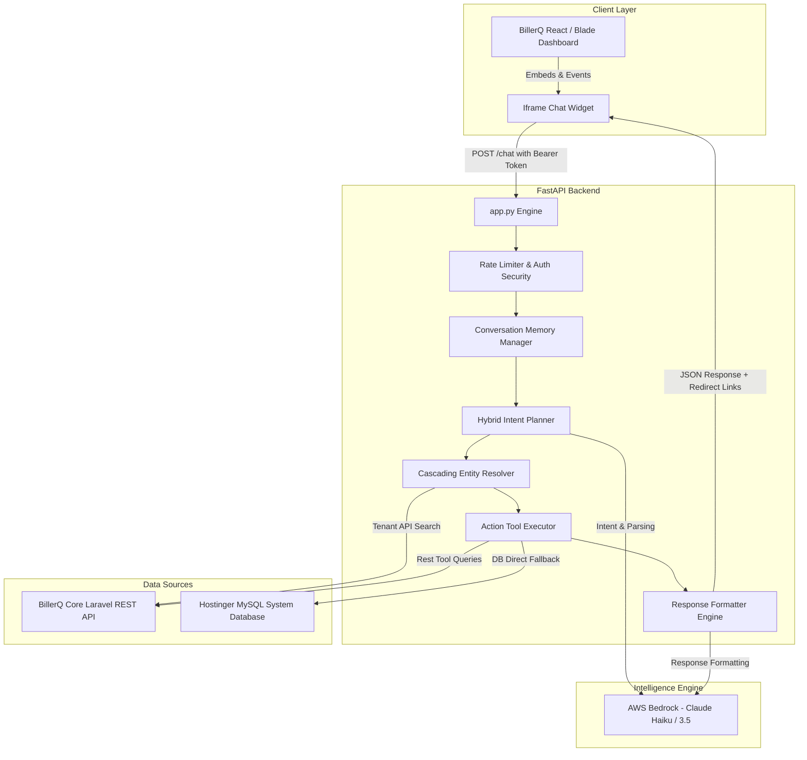

# BillerQ AI Assistant — Enterprise Multi-Tenant AI Agent & Operational Analytics Suite

[](https://fastapi.tiangolo.com/)
[](https://aws.amazon.com/bedrock/)
[](https://www.python.org/)
[](https://www.mysql.com/)
[](#)

The **BillerQ AI Assistant** is an enterprise-grade, context-aware AI agent and conversational analytics platform engineered specifically for the **BillerQ Cable TV, Broadband, and Subscription Management Ecosystem**. 

Unlike naive Q&A chatbots, BillerQ AI Assistant operates as an **autonomous agentic orchestration pipeline**. It bridges natural language queries from administrators and support agents directly to live, multi-tenant BillerQ REST APIs and database layers—executing subscriber lookups, financial summaries, complaints tracking, package catalog lookups, and operational reporting in real-time.

---

## 📋 Table of Contents

1. [Executive Summary & Core Architecture](#-executive-summary--core-architecture)
2. [End-to-End Processing Pipeline](#-end-to-end-processing-pipeline)
3. [Architecture Diagrams](#-architecture-diagrams)
4. [Key Capabilities & Feature Catalog](#-key-capabilities--feature-catalog)
5. [Codebase & File Map Reference](#-codebase--file-map-reference)
6. [Multi-Tenant Auth & Security Model](#-multi-tenant-auth--security-model)
7. [Environment Configuration Reference](#-environment-configuration-reference)
8. [Production Deployment & Frontend Integration](#-production-deployment--frontend-integration)
9. [Local Development & Automated Testing](#-local-development--automated-testing)

---

## 🛡️ Executive Summary & Core Architecture

In modern multi-tenant SaaS environments, operational users require fast access to metrics across thousands of subscriber accounts without navigating through deep nested dashboard pages. The BillerQ AI Assistant solves this by providing a unified natural language interface backed by:

* **AWS Bedrock LLM Integration**: Powered by Anthropic Claude 3.5 / Haiku models for ultra-low latency intent parsing and structured response formatting.
* **Stateful Session Memory**: Tracks user conversation turns and resolves pronouns (e.g., *"his balance"*, *"her active packages"*) back to previously referenced subscriber entities.
* **Hybrid Fast Router**: Employs high-speed regex pattern matching to bypass LLM generation for standard dashboard metrics, ensuring sub-second response times.
* **Cascading Resolver with Product Catalog Fallback**: Automatically cleans entity inputs, executes multi-attribute subscriber matching (Subscriber ID $\rightarrow$ Phone $\rightarrow$ Name), and falls back seamlessly to package/addon/item catalogs if no subscriber matches.
* **Dynamic Multi-Tenancy & Zero Data Leakage**: Dynamically inherits user session tokens and company tenant endpoints (`https://<tenant>.billerq.com`), maintaining strict data isolation across clients.
* **Pagination & Truncation Shielding**: Prunes bulky nested API payloads (e.g., stripping comment logs from complaint payloads) to keep LLM context limits intact while preserving global metrics like total database count.
* **Actionable UI Deep Linking**: Generates context-aware React route metadata (`redirect_url`, `redirect_label`) to render dynamic one-click navigation buttons directly in the chat widget.

---

## ⚡ End-to-End Processing Pipeline

Every message submitted to the BillerQ AI Assistant moves through a synchronous 6-stage lifecycle:

```
[ User Input (React UI / Chat Widget) ]
                  │
                  ▼
┌─────────────────────────────────────────────────────────┐
│ 1. FastAPI Gateway & Daily Session Limiter              │
│    - Evaluates session token & daily prompt allowance  │
└─────────────────────────┬───────────────────────────────┘
                          │
                          ▼
┌─────────────────────────────────────────────────────────┐
│ 2. Session Memory & Pronoun Resolver                    │
│    - Replaces possessive pronouns ("his", "her", "their")│
│      with target subscriber entity from context history│
└─────────────────────────┬───────────────────────────────┘
                          │
                          ▼
┌─────────────────────────────────────────────────────────┐
│ 3. Hybrid Intent Router & Planner                       │
│    - Fast Route: Matches regex rules for direct metric  │
│    - Neural Route: AWS Bedrock extracts intent & args   │
└─────────────────────────┬───────────────────────────────┘
                          │
                          ▼
┌─────────────────────────────────────────────────────────┐
│ 4. Cascading Entity & Catalog Resolver                  │
│    - Resolves subscriber ID / Phone / Name             │
│    - Fallback: Product catalog (Packages/Addons/Items) │
└─────────────────────────┬───────────────────────────────┘
                          │
                          ▼
┌─────────────────────────────────────────────────────────┐
│ 5. Action Executor & Data Aggregator                    │
│    - Dispatches scoped HTTP calls to BillerQ REST API   │
│    - Optional DB agent fallback to Hostinger MySQL DB   │
│    - Sanitizes & prunes nested JSON payload bloat       │
└─────────────────────────┬───────────────────────────────┘
                          │
                          ▼
┌─────────────────────────────────────────────────────────┐
│ 6. Hybrid Formatter & UI Link Injector                  │
│    - Formats markdown table/list with visual badges     │
│    - Appends dynamic React navigation metadata         │
└─────────────────────────┬───────────────────────────────┘
                          │
                          ▼
[ Formatted Response Payload + Interactive UI Shortcut ]
```

---

## 📐 Architecture Diagrams

### High-Level System Architecture



---

## 🚀 Key Capabilities & Feature Catalog

The system provides complete operational coverage across 11 key functional domains:

| Category | Tools & Capabilities | Key Endpoints / Actions |
| :--- | :--- | :--- |
| **Subscriber Management** | Customer search, full profiles, STB/Modem assignments, wallet balances, archived records. | `search_customer`, `get_customer_profile`, `get_customer_stb`, `get_unpaid_customers` |
| **Complaints & Support** | Ticket status summaries, active complaint lists, issue categorization, priority tracking. | `get_complaints`, `get_complaint_status_count` |
| **Financials & Billing** | Payment collection history, recent transactions, overdue accounts, unpaid bills, recurring profiles. | `get_payment_history`, `get_recent_payments`, `get_overdues`, `get_cancelled_invoices` |
| **Service Catalog** | Package listings, add-on options, product items, pricing & tax breakdowns. | `get_packages`, `get_all_addons`, `get_items` |
| **Agent Collections** | Field agent collection reports, leaderboards, revenue totals, method breakdowns. | `get_agent_collection_report`, `get_tax_report` |
| **Banking & Accounts** | Bank account listings, deposit tracking, transaction logs. | `get_bank_accounts`, `get_bank_transactions` |
| **Expenses & Income** | Vendor expenses, header summaries, income logs, company ledger metrics. | `get_expenses`, `get_income`, `get_vendors`, `get_expense_headers` |
| **Lead Management** | Customer enquiries, lead conversion logs, pending follow-ups. | `get_enquiries`, `get_leads`, `get_followups` |
| **Staff & RBAC** | System user lists, staff roles, permission lookups. | `get_staff`, `get_roles` |
| **System Settings** | Service areas, ISP provider lists, credit settings. | `get_areas`, `get_providers` |
| **Communication Logs** | SMS dispatch logs, WhatsApp message usage, credit balances. | `get_sms_logs`, `get_whatsapp_logs` |

---

## 📁 Codebase & File Map Reference

The complete system repository layout and component responsibilities:

```
BILLERQQ/
├── README.md                                    # Primary Root Documentation
├── CHATBOT_ARCHITECTURE_AND_WORKING.md          # Comprehensive Architecture Manual
├── serve_frontend.py                             # Development Static Web Server
├── start_dev.bat                                # Windows Batch Launcher
├── build/                                       # Production React Frontend Build Directory
└── ai-agent/                                    # AI Agent Core Engine Directory
    ├── app.py                                   # FastAPI Web Server, CORS & Lifespan Router
    ├── config.py                                # System Environment & Global Configurations
    ├── database.py                              # Hostinger MySQL Connection & Session Pool
    ├── auth_db.py                               # DB Authentication & Session Handler
    ├── tools_db.py                              # Direct MySQL Database Query Tools
    ├── schema_docs.py                           # MySQL Database Schema Specifications
    ├── requirements.txt                         # Python Dependencies List
    ├── .env                                     # Environment Variables & API Credentials
    ├── agent/                                   # Core Orchestrator & Reasoning Layer
    │   ├── agent_loop.py                        # E2E Agent Runner & Orchestration Pipeline
    │   ├── planner.py                           # Intent Classification & Arg Extractor
    │   ├── resolver.py                          # Entity Matcher & Product Catalog Fallback
    │   ├── executor.py                          # Tool Dispatcher & Payload Sanitizer
    │   ├── formatter.py                         # LLM & Template Response Builder
    │   ├── memory.py                            # Session Tracker & Pronoun Resolver
    │   ├── analyzer.py                          # Data Aggregator & Payload Capping Shield
    │   ├── reasoner.py                          # Complex Multi-Step Reasoning Engine
    │   ├── query_processor.py                   # Natural Language Query Normalizer
    │   ├── analytics.py                         # Revenue & Metrics Calculation Engine
    │   └── route_manager.py                     # Dynamic UI Route Metadata Resolver
    ├── api/                                     # HTTP Networking & REST Integration Layer
    │   ├── client.py                            # Async HTTP Client with Auto-Login & 401 Retries
    │   └── registry.py                          # BillerQ API Route & Endpoint Registry
    ├── llm/                                     # LLM Provider Drivers
    │   ├── base.py                              # Base LLM Interface Definition
    │   ├── bedrock_provider.py                  # AWS Bedrock Claude 3.5 / Haiku Integration
    │   └── groq_provider.py                     # Groq LLM Driver Integration
    ├── tools/                                   # Domain API Tool Modules
    │   ├── customer.py                          # Subscriber Lookups & STB Tools
    │   ├── payment.py                           # Invoices, Overdues & Transaction Tools
    │   ├── subscription.py                      # Package, Addon & Catalog Tools
    │   ├── reports.py                           # Collection Reports & Tax Tools
    │   ├── complaints.py                        # Complaint Ticket Tracking Tools
    │   ├── lead.py                              # Enquiries, Leads & Follow-ups
    │   ├── banking.py                           # Bank Accounts & Transactions
    │   ├── expenses_income.py                   # Expense Ledger & Vendor Tools
    │   ├── staff.py                             # Staff & Role Management Tools
    │   ├── settings.py                          # Service Areas & Provider Tools
    │   └── communication.py                     # SMS & WhatsApp Usage Logs
    ├── chat-widget/                             # Embedded Frontend UI Components
    │   └── chat.html                            # Iframe Widget with CryptoJS Token Decryption
    └── tests/                                   # Automated Integration Test Suite
        ├── test_agent_pipeline.py               # E2E Pipeline Verification Suite
        ├── test_chat_integration.py             # FastAPI Chat Endpoint Integration Tests
        ├── test_db_agent.py                     # MySQL DB Agent Execution Tests
        └── test_pronoun_resolution.py           # Pronoun Resolver Unit Tests
```

---

## 🔒 Multi-Tenant Auth & Security Model

The BillerQ AI Assistant uses a multi-layered security architecture designed to prevent unauthorized data access and cross-tenant data leakage:

### 1. Dynamic Tenant Host Switching
When authenticating, the API client posts credentials to the primary BillerQ login endpoint (`https://admin.billerq.com/public/api/login`). The backend payload contains the company tenant URL (e.g., `https://tenant-name.billerq.com`). The client updates its base URL dynamically, routing all subsequent requests directly to the dedicated company backend.

### 2. Frontend Session Token Decryption & Forwarding
The React frontend encrypts user session data into `localStorage` using CryptoJS AES encryption. The chat widget ([chat.html](file:///c:/Users/advai/Desktop/BILLERQQ/ai-agent/chat-widget/chat.html)) decrypts the payload on initialization:
```javascript
const decrypted = CryptoJS.AES.decrypt(loginStr, 'ENCRYPTION_KEY').toString(CryptoJS.enc.Utf8);
const loginData = JSON.parse(decrypted);
const userToken = loginData.userToken;
```
The widget forwards the token via request headers (`billerq-token`, `Authorization: Bearer <userToken>`). The backend agent executes all API lookups strictly under the permissions of the logged-in administrator.

### 3. Automatic 401 Interception & Re-Authentication
If a request returns an HTTP `401 Unauthorized` status (indicating token expiry), `BillerQClient` intercepts the failure, acquires an async lock, invalidates the stale token, executes `_login()` to fetch a fresh token, and automatically retries the original request.

---

## ⚙️ Environment Configuration Reference

The system behavior is controlled by environment variables specified in [ai-agent/.env](file:///c:/Users/advai/Desktop/BILLERQQ/ai-agent/.env):

```env
# BillerQ API Configuration
BILLERQ_API_BASE=https://admin.billerq.com/public/api
BILLERQ_AUTO_LOGIN=true
BILLERQ_INDUSTRY_ID=1
DEMO_MODE=false

# Daily Session Rate Limiter (0 = unlimited, e.g., 50 prompts/day)
PROMPT_LIMIT_PER_DAY=0

# LLM Provider Configuration (AWS Bedrock)
MODEL_PROVIDER=bedrock
AWS_ACCESS_KEY_ID=YOUR_AWS_ACCESS_KEY
AWS_SECRET_ACCESS_KEY=YOUR_AWS_SECRET_KEY
AWS_REGION=us-east-1
BEDROCK_MODEL_ID=us.anthropic.claude-haiku-4-5-20251001-v1:0

# Database Configuration (Hostinger MySQL)
DB_HOST=srv1145.hstgr.io
DB_PORT=3306
DB_USER=u167254999_bqcustomerai
DB_PASSWORD=YOUR_DB_PASSWORD
DB_NAME=u167254999_BqCustomerAi
```

---

## 🏭 Production Deployment & Frontend Integration

### Phase A: Backend Deployment (FastAPI)

1. **Host Server**: Deploy to AWS EC2, Elastic Beanstalk, or containerized via AWS ECS (Fargate).
2. **AWS Bedrock IAM Security**: For production, avoid plain-text AWS keys in `.env`. Attach an IAM Role to your container/instance with the following inline policy:
   ```json
   {
     "Version": "2012-10-17",
     "Statement": [
       {
         "Effect": "Allow",
         "Action": [
           "bedrock:InvokeModel",
           "bedrock:InvokeModelWithResponseStream"
         ],
         "Resource": "*"
       }
     ]
   }
   ```
3. **Production ASGI Server**: Run using Gunicorn with Uvicorn worker threads:
   ```bash
   gunicorn app:app -w 4 -k uvicorn.workers.UvicornWorker --bind 0.0.0.0:8080
   ```

### Phase B: Frontend Integration (React / HTML)

1. **Embed Widget Container**: Insert the chat iframe into your main layout template:
   ```html
   <div id="billerq-chatbot-container" style="position: fixed; bottom: 20px; right: 20px; z-index: 9999;">
       <iframe src="/chat-widget/chat.html" id="chatbot-iframe" style="border: none; width: 400px; height: 600px; display: none;"></iframe>
       <button id="chatbot-toggle-btn">💬 Chat</button>
   </div>
   ```
2. **Listen for UI Redirection Events**: The widget emits postMessage events when users click action buttons:
   ```javascript
   window.addEventListener('message', (event) => {
       if (event.data && event.data.type === 'BILLERQ_NAVIGATE') {
           // Direct React Router navigation
           history.push(event.data.url);
       }
   });
   ```

---

## 🧪 Local Development & Automated Testing

### Prerequisites
* Python 3.10 or higher
* Valid AWS Access Keys with Bedrock Claude access (or local test credentials)
* Active BillerQ API backend or access credentials

### Installation & Setup

1. **Clone Repository & Navigate to Agent Core**:
   ```bash
   cd ai-agent
   ```

2. **Create & Activate Virtual Environment**:
   ```bash
   python -m venv venv
   # On Windows:
   .\venv\Scripts\activate
   # On Linux/macOS:
   source venv/bin/activate
   ```

3. **Install Dependencies**:
   ```bash
   pip install -r requirements.txt
   ```

4. **Launch the FastAPI Server**:
   ```bash
   uvicorn app:app --host 0.0.0.0 --port 8080 --reload
   ```
   * The API documentation will be available interactively at `http://localhost:8080/docs`.

5. **Run the Test Suite**:
   ```bash
   pytest tests/
   ```

---

## 📄 License & Maintainers

This project is proprietary and confidential. Authorized strictly for use within the **BillerQ** platform ecosystem. All rights reserved.
