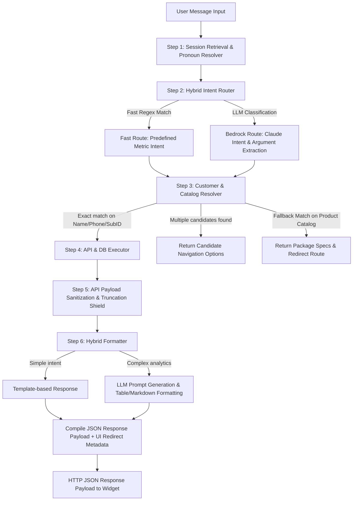

# BillerQ AI Assistant — Agent Core Technical & Integration Guide

[](https://fastapi.tiangolo.com/)
[](https://aws.amazon.com/bedrock/)
[](https://www.python.org/)

This sub-directory contains the core Python engine, FastAPI application, LLM driver wrappers, entity resolvers, and automated tool integrations for the **BillerQ AI Assistant**.

---

## 🏗️ Architecture & Component Flow

The agent operates as a stateful, multi-tenant middleware between the BillerQ web frontend (React/Blade) and the BillerQ Laravel REST API / MySQL database backend.



---

## 📂 Sub-Directory File Reference

All files in the `ai-agent` core and their specific roles:

### Server & Global App Setup
*   **[app.py](file:///c:/Users/advai/Desktop/BILLERQQ/ai-agent/app.py)** — FastAPI application server entry point. Exposes `POST /chat`, handles CORS, implements daily session rate limiting, and maps UI redirect metadata (`_resolve_redirection_metadata`).
*   **[config.py](file:///c:/Users/advai/Desktop/BILLERQQ/ai-agent/config.py)** — Configuration variables loader reading from `.env`.
*   **[database.py](file:///c:/Users/advai/Desktop/BILLERQQ/ai-agent/database.py)** — Hostinger MySQL connection manager and session connection pool handler.
*   **[auth_db.py](file:///c:/Users/advai/Desktop/BILLERQQ/ai-agent/auth_db.py)** — User authentication state and DB session logging logic.
*   **[tools_db.py](file:///c:/Users/advai/Desktop/BILLERQQ/ai-agent/tools_db.py)** — Direct SQL query execution tools for advanced DB queries.
*   **[schema_docs.py](file:///c:/Users/advai/Desktop/BILLERQQ/ai-agent/schema_docs.py)** — Database table schemas and entity relationship metadata for the LLM.
*   **[.env](file:///c:/Users/advai/Desktop/BILLERQQ/ai-agent/.env)** — System credentials (AWS Bedrock keys, MySQL host/user/pass, API base URL).
*   **[requirements.txt](file:///c:/Users/advai/Desktop/BILLERQQ/ai-agent/requirements.txt)** — Core Python dependencies (`fastapi`, `uvicorn`, `boto3`, `httpx`, `python-dotenv`, `pydantic`, `mysql-connector-python`).

### Agent Core Logic (`agent/` folder)
*   **[agent/agent_loop.py](file:///c:/Users/advai/Desktop/BILLERQQ/ai-agent/agent/agent_loop.py)** — Primary agent execution loop (`BillerQAgent`), tying together planning, resolution, execution, payload pruning, and response generation.
*   **[agent/planner.py](file:///c:/Users/advai/Desktop/BILLERQQ/ai-agent/agent/planner.py)** — Intent classifier using AWS Bedrock Claude models to transform user prompts into structured JSON plans.
*   **[agent/resolver.py](file:///c:/Users/advai/Desktop/BILLERQQ/ai-agent/agent/resolver.py)** — Resolves ambiguous subscriber references (subscriber ID, phone number, partial names) with fallbacks to package/addon catalogs.
*   **[agent/executor.py](file:///c:/Users/advai/Desktop/BILLERQQ/ai-agent/agent/executor.py)** — Maps resolved plans to tool executions in `tools/` or `tools_db.py`.
*   **[agent/formatter.py](file:///c:/Users/advai/Desktop/BILLERQQ/ai-agent/agent/formatter.py)** — Formats raw JSON output into human-readable Markdown tables, lists, and summary statistics.
*   **[agent/memory.py](file:///c:/Users/advai/Desktop/BILLERQQ/ai-agent/agent/memory.py)** — In-memory session manager (`ConversationMemory`), handling pronoun resolution across consecutive user turns.
*   **[agent/analyzer.py](file:///c:/Users/advai/Desktop/BILLERQQ/ai-agent/agent/analyzer.py)** — Data sanitization layer that caps JSON payload sizes (4000 char shield) and extracts top pagination metrics.
*   **[agent/reasoner.py](file:///c:/Users/advai/Desktop/BILLERQQ/ai-agent/agent/reasoner.py)** — Multi-step reasoning pipeline for complex analytical tasks.
*   **[agent/query_processor.py](file:///c:/Users/advai/Desktop/BILLERQQ/ai-agent/agent/query_processor.py)** — Input query normalizer and keyword extractor.
*   **[agent/analytics.py](file:///c:/Users/advai/Desktop/BILLERQQ/ai-agent/agent/analytics.py)** — Financial metrics calculation engine (sums, method breakdowns, collections).
*   **[agent/route_manager.py](file:///c:/Users/advai/Desktop/BILLERQQ/ai-agent/agent/route_manager.py)** — Dynamic React router link resolver.

### Tool Integrations (`tools/` folder)
*   **[tools/customer.py](file:///c:/Users/advai/Desktop/BILLERQQ/ai-agent/tools/customer.py)** — Customer search, profile fetch, STB/Modem lookups, status counts.
*   **[tools/payment.py](file:///c:/Users/advai/Desktop/BILLERQQ/ai-agent/tools/payment.py)** — Payment logs, invoice lists, overdues, unpaid customer queries.
*   **[tools/subscription.py](file:///c:/Users/advai/Desktop/BILLERQQ/ai-agent/tools/subscription.py)** — Package catalog, add-on lookups, item listings.
*   **[tools/reports.py](file:///c:/Users/advai/Desktop/BILLERQQ/ai-agent/tools/reports.py)** — Collection reports, tax summaries, agent leaderboards.
*   **[tools/complaints.py](file:///c:/Users/advai/Desktop/BILLERQQ/ai-agent/tools/complaints.py)** — Complaint ticket tracking and status analytics.
*   **[tools/lead.py](file:///c:/Users/advai/Desktop/BILLERQQ/ai-agent/tools/lead.py)** — Lead manager, enquiries, and follow-up tracking.
*   **[tools/banking.py](file:///c:/Users/advai/Desktop/BILLERQQ/ai-agent/tools/banking.py)** — Bank accounts and transaction history.
*   **[tools/expenses_income.py](file:///c:/Users/advai/Desktop/BILLERQQ/ai-agent/tools/expenses_income.py)** — Vendor expense logs and income summary tools.
*   **[tools/staff.py](file:///c:/Users/advai/Desktop/BILLERQQ/ai-agent/tools/staff.py)** — User roles and staff listings.
*   **[tools/settings.py](file:///c:/Users/advai/Desktop/BILLERQQ/ai-agent/tools/settings.py)** — Service areas and provider settings.
*   **[tools/communication.py](file:///c:/Users/advai/Desktop/BILLERQQ/ai-agent/tools/communication.py)** — SMS/WhatsApp usage logs.

### LLM Interface Layer (`llm/` folder)
*   **[llm/base.py](file:///c:/Users/advai/Desktop/BILLERQQ/ai-agent/llm/base.py)** — Abstract LLM driver base class.
*   **[llm/bedrock_provider.py](file:///c:/Users/advai/Desktop/BILLERQQ/ai-agent/llm/bedrock_provider.py)** — AWS Bedrock client implementation supporting Anthropic Claude 3.5 / Haiku models.
*   **[llm/groq_provider.py](file:///c:/Users/advai/Desktop/BILLERQQ/ai-agent/llm/groq_provider.py)** — Alternative Groq provider driver implementation.

### API Layer (`api/` folder)
*   **[api/client.py](file:///c:/Users/advai/Desktop/BILLERQQ/ai-agent/api/client.py)** — Async HTTP client with connection pooling, multi-tenant host redirection, token overrides, and 401 automatic retry locks.
*   **[api/registry.py](file:///c:/Users/advai/Desktop/BILLERQQ/ai-agent/api/registry.py)** — Endpoint route mapping dictionary for BillerQ Laravel REST API endpoints.

---

## ⚡ Execution Pipeline Details

When a request is submitted to `POST /chat`:

1. **Ingestion & Rate Limit Check**:
   `app.py` receives the JSON request with `message`, `session_id`, and `billerq_token`. If `PROMPT_LIMIT_PER_DAY` is set, it verifies that the session hasn't exceeded its allowance.

2. **Session Memory & Pronoun Resolution**:
   `memory_manager.get_session(session_id)` loads session context. `ConversationMemory.resolve_pronoun()` scans the prompt for pronouns (*"his"*, *"her"*, *"their"*) and replaces them with the stored target entity name.

3. **Hybrid Intent Routing**:
   The prompt is passed to `Planner.plan()`. Fast regex rules attempt to match known metrics instantly. If unmatched, AWS Bedrock Claude parses the prompt and generates a structured JSON execution plan containing `intent`, `entities`, and `args`.

4. **Entity Resolution**:
   If an entity (customer/subscriber) is required, `Resolver.resolve_customer()` performs sanitized search queries. If no customer matches, it cascades to scan packages, add-ons, and items in the catalog.

5. **Tool Execution & Sanitization**:
   `Executor.execute()` dispatches the request to the mapped function in `tools/` (or `tools_db.py`). Responses are passed through `analyzer.py` to prune bulky fields (e.g. comment logs) and enforce payload limits (4000 chars).

6. **Response Generation & UI Link Injection**:
   `Formatter.format_response()` converts the raw data into clean Markdown formatting. `app.py` resolves matching React routes via `_resolve_redirection_metadata()` and returns the final JSON response payload.

---

## 🧪 Testing

To run unit and integration tests:

```bash
pytest tests/
```

Individual test targets:
* `pytest tests/test_agent_pipeline.py` — Tests end-to-end pipeline execution.
* `pytest tests/test_chat_integration.py` — Tests FastAPI `/chat` endpoint.
* `pytest tests/test_pronoun_resolution.py` — Tests pronoun memory resolution.